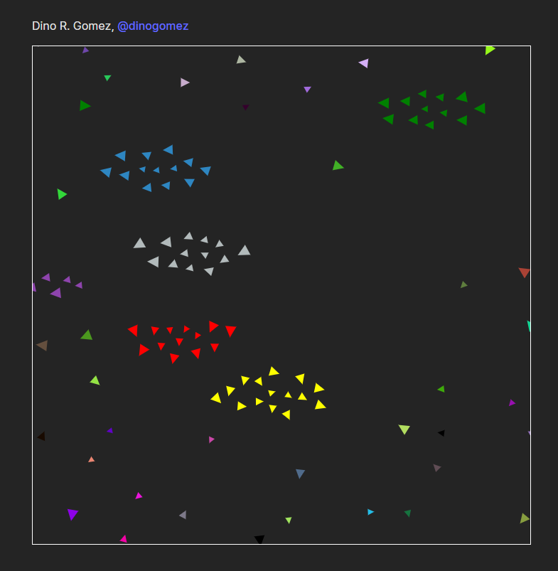

# aquarium
A simple particle system that generates a ecosystem where same colored particles flock together following a flocking behavior, particles also wander around. I implemented a cohesion, avoidance and alignment behavior for each particle. 
  
